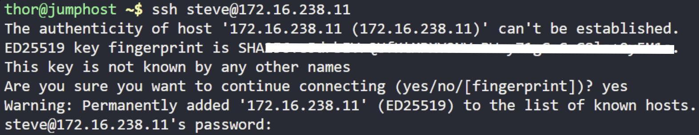
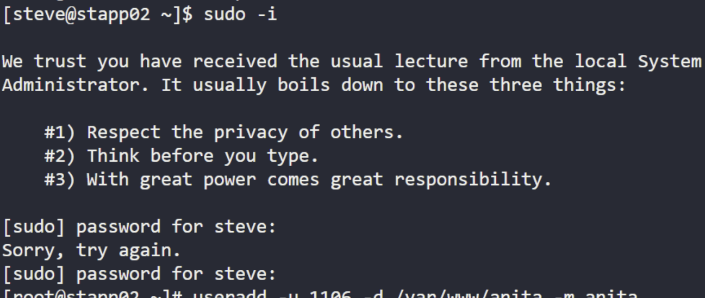
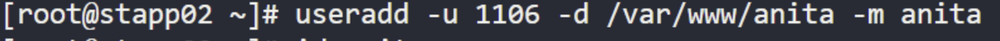
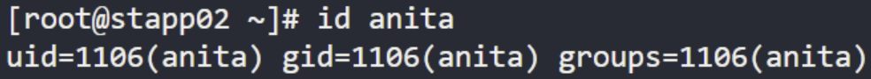
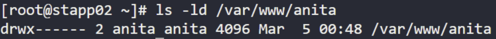

# Create a Custom Apache User

## Objective

Create a custom Apache user for enhanced application security.

### Requirements

- **Username:** `anita`
- **UID:** `1106`
- **Home Directory:** `/var/www/anita`
- **Server:** App Server 2 (`stapp02`)

---

## Steps

### 1. Connect to App Server 2

```bash
ssh steve@172.16.238.11
```


### 2. Become root

```bash
sudo -i
```


### 3. Create the user

```bash
useradd -u 1106 -d /var/www/anita -m anita
```


### 4. Verify the user

```bash
id anita
```



### 5. Verify the home directory

```bash
ls -ld /var/www/anita
```


---

## Command Summary

```bash
ssh steve@172.16.238.11
sudo -i
useradd -u 1106 -d /var/www/anita -m anita
id anita
ls -ld /var/www/anita
```

---

## Result

A custom Apache user named **anita** is created with:

- UID: **1106**
- Home Directory: **/var/www/anita**
- Home directory created automatically using the `-m` option.

## Key Takeaway

Creating a dedicated Linux user with a unique UID and home directory improves application isolation, simplifies user management, and follows the principle of least privilege by separating application access from individual user accounts.

